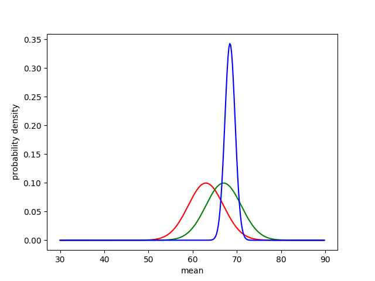

## What is a $t$-test?

A $t$-test is any hypothesis test in which the test statistic follows a Student's $t$-distribution.

The $t$-test is for normally distributed populations.  Consider we are in a situation where we know a population is normally distributed, but we don't know what the mean $\mu$ is.  Then a $t$-test is appropriate.

For example, our population could be men in Bolivia.  The value we are measuring could be height.  The $t$-test would be appropriate to our example because human heights are normally distributed.

## So what is $t$?

The $t$ in a $t$-test is a measure of ERROR!  In particular, assuming that our predicted mean $\mu$ is correct, it measures how bad our sample mean $X$ is.

$\displaystyle t=\frac{(X-\mu)}{\frac{s}{\sqrt{n}}}$

$\mu$ is the predicted mean.  $X$ is the sampled mean, $s$ is the sampled standard deviation, and $n$ is the number of data points sampled.

This is designed so that an accurate $\mu$ will lead to a small value of $t$!  Observe that if $\mu$ is close to $X$, $t$ gets smaller.  Assuming $\mu$ is accurate, we expect $X$ to get closer to $\mu$ as we sample more and more data points.  Therefore, we multiply by $\sqrt{n}$ to counterbalance this.  In order to have a "good fit," we need $\mu$ and $X$ to be *so close* that they beat the growth of $\sqrt{n}$!

For example, this [website](http://www.averageheight.co/average-male-height-by-country) says that the mean height of men in Bolivia is $\mu$=5'3" (or 64 inches), our predicted mean.  Now, we all take a flight down to Bolivia where we choose $n$ men at random and record their heights.  The mean $X$ of these heights is our sampled mean, and the standard deviation $s$ of these heights is our sampled standard deviation.

## And what is $p$?

How do we know when our error $t$ is small enough to conclude that our predicted $\mu$ was correct?  By convention, we choose a specific 'cut-off' where we conclude our $\mu$ was correct.  That is where $p$ comes into play...

"$p$-value" means "probability value".  Assuming that $\mu$ is the correct mean, $p$ is the probability of obtaining an error of $t$ or worse.

If $p$ is below $5\%$, this is bad news.  It means that if $\mu$ was correct, there was less than a $5\%$ chance of picking people with these heights.  In this situation, we conclude that our predicted mean was wrong.

## How do I calculate $p$?

Knowing $n$ and $t$ is enough information to calculate $p$.  We first calculate the number of degrees of freedom, which is simply $n-1$.  Then using the degrees of freedom and $t$, we can look up $p$ in a [table](http://www.sjsu.edu/faculty/gerstman/StatPrimer/t-table.pdf).

Note that the left column "df" is the degrees of freedom, and the values in the table are $t$-values.

In our example, we had $n-1 = 5-1 = 4$ degrees of freedom.  So we look at row $4$ in the table.  We also had a $t$-value of $3.7$.  We have to take the worst-case scenario and round our error ($t$-value) UP to the next $t$-value we see in the row, which is $3.747$.  Finally, we observe that the corresponding $p$-value is $0.01$, or $1\%$.

This is less than the $5\%$ cut-off, so unfortunately we must conclude that our predicted mean $\mu=63$ inches was WRONG.

## How are $t$ and $p$ related?

Recall that $t$ measures error, and $p$ measures the probability of obtaining such error (or worse) assuming $\mu$ is correct.

Then $t = 0$ must give a probability of $p = 100\%$.

As $t$ increases, $p$ must decrease.

## What is precision and recall?

Let's say our population is a bunch of frogs.  There is a certain probability that a randomly chosen frog will display the y gene, which is correlated to another gene.

*Precision*

Of those classified as Will return, what proportion actually did?
True positive / (True positive + False positive)

Recall: Of those that in fact Returned, what proportion were classified that way?
True positive / (True positive + False negative)

## Bayes' Rule

Let's say that

$\displaystyle A$

is some event that could occur (or not occur), and $B$ is some other event.  Then

$\displaystyle p(A)$

is the probability that $A$ occurs, and similarly $p(B)$ is the probability that $B$ occurs.  Now

$\displaystyle p(A , B)$

is the probability that both $A$ and $B$ occur.

$\displaystyle p(A \mid B)$

is the probability that $A$ occurs if we already know that $B$ occurs.  In other words, the probability of "$A$ given $B$".  Bayes rule is an equation involving these concepts, which we will soon derive.  One way to calculate the probability that $A$ and $B$ both occur is to take the probability that $A$ occurs, and now that we've chosen $A$ to occur, multiply by the probability that $B$ occurs given $A$ is already occuring:

$\displaystyle p(A , B) =  p(B \mid A) \cdot p(A)$

Switching the roles of $B$ and $A$, we also have

$\displaystyle p(A , B) = p(B) \cdot p(A \mid B).$

Finally, we can set these equal to each other

$\displaystyle p(A) \cdot p(B \mid A) = p(B) \cdot p(A \mid B)$

and if we'd like, solve for $p(A \mid B)$:

$\displaystyle p(A \mid B) = \frac{p(A) \cdot p(B \mid A)}{p(B)}.$

This final equation is known as Bayes' Rule.

## What is Posterior sampling?

Firstly, what is the 'posterior distribution'?

Let $T$ represent some information about our population, say, the mean height.

We have an initial *predicted* distribution $p(T)$, and then we draw some sample data $X$ from our population.  The idea of 'posterior' is to get better preditions about our population *after* (hence, 'post') having seen some sample data $X$ from it.  We use Bayes formula:

$\displaystyle P(T \mid X) = \frac{P(T) \cdot P(X \mid T)}{P(X)}$

which is not only true for probabilities, but for probability density functions / distributions:

$\displaystyle p(T \mid X) = \frac{p(T) \cdot p(X \mid T)}{p(X)}$

Here, $p(T \mid X)$ represents is the 'posterior distribution', which is the new best guess of the distribution of $T$, thanks to the information $X$.  As you can see $p(T \mid X)$ takes into account the original predicted distribution $p(T)$ as well as information about $X$.

## What is a 'conjugate' prior?

First we need to introduce some vocabulary.  In the posterior equation

$\displaystyle p(T \mid X) = \frac{p(X \mid T) \cdot p(T)}{p(X)}$,

$p(T)$ is called the *prior* distribution, $p(X \mid T)$ is called the *likelihood*, and the left-hand-side $p(T \mid X)$ is called the *posterior* distribution.

We are often in a situation where we know the distributions on the right-hand-side of the equation, but it is still hard to multiply them and get a nice posterior distribution.

This is where a 'conjugate' prior is so helpful!  It turns out that if the prior distribution is conjugate to the likelihood, then the posterior distribution will be very similar to the prior distribution, thus making our lives easy!

Definition: A family F of prior distributions is called *conjugate* to a likelihood distribution if the resulting posterior distribution is in F.

Here is a table of useful conjugate priors:

"likelihood" conjugate to "prior"...
Bernouilli conjugate to Beta
Binomial conjugate to Beta
Beta conjugate to Beta
Normal conjugate to Normal (for the mean)

## An example of posterior sampling.

Here is some code that does posterior sampling.

~~~
#!/usr/bin/env python3
# pretend we have a population of 100 people, and each person has a height.  The heights are normally distributed with mean MEAN_ACTUAL = 67 inches.  But WE THINK that the mean is m_guess = 63.  Then we draw a sample X of 10 people from the population.  Finally, we use the sample X to calculate the posterior distribution of people's heights.

import matplotlib.pyplot as plt
import numpy as np
import scipy as sp
from scipy import stats

# GLOBALS
MEAN_ACTUAL = 67
STD_DEV_ACTUAL = 4
# p(T)
MEAN_GUESS = 63
STD_DEV_GUESS = 4
# other
NUM_SAMPLES = 10

# p(T | X) = p(X | T) * p(T) / p(X)

# plot setup
plt.xlabel('mean')
plt.ylabel('probability density')
x_ = np.arange(30, 90, 0.2)

# prior distribution:
# p(T)
def p_T(x):
  return sp.stats.norm.pdf(x, loc=MEAN_GUESS, scale=STD_DEV_GUESS)
y_ = [p_T(x) for x in x_]
plt.plot(x_, y_, 'r')

# actual distribution:
def p_true(x):
  return sp.stats.norm.pdf(x, loc=MEAN_ACTUAL, scale=STD_DEV_ACTUAL)
y_ = [p_true(x) for x in x_]
plt.plot(x_, y_, 'g')

# likelihood:
# p(X | T) = prod_j p(x_j | T)

# take some samples from the actual distribution
samples = np.random.normal(loc=MEAN_ACTUAL, scale=STD_DEV_ACTUAL, size=NUM_SAMPLES)
mean_samples = np.mean(samples)
std_dev_samples = np.std(samples)

# p(X)
# is just a constant when we consider the mean T to be the variable.

# p(T | X)
# must be normal, since likelihood and prior distribution are normal.  Therefore, we need only find the mean and standard deviation.
variance_new = 1 / (1/STD_DEV_GUESS**2 + NUM_SAMPLES * 1/std_dev_samples**2)
std_dev_new = np.sqrt(variance_new)
mean_new = variance_new * (MEAN_GUESS/STD_DEV_GUESS**2 + NUM_SAMPLES * mean_samples/std_dev_samples**2)
def p_T_X(x):
  return sp.stats.norm.pdf(x, loc=mean_new, scale=std_dev_new)
y_ = [p_T_X(x) for x in x_]
plt.plot(x_, y_, 'b')

# output
print('new mean = {}'.format(mean_new))
print('new std dev = {}'.format(std_dev_new))
plt.show()
~~~

You see that the new predicted mean is now much closer to 67 than before.

Resources Used in the making of this tutorial
-----------------------------------------------
  * [Wikipedia: Student's t-test](https://en.wikipedia.org/wiki/Student%27s_t-test)
  * [Wikipedia: t-distribution](https://en.wikipedia.org/wiki/Student%27s_t-distribution)
  * [Wikipedia: p-value](https://en.wikipedia.org/wiki/p-value)
  * [sjsu.edu: t-table](http://www.sjsu.edu/faculty/gerstman/StatPrimer/t-table.pdf)
  * [Wikipedia: Bayes theorem](https://en.wikipedia.org/wiki/Bayes%27_theorem)
  * [YouTube: Bayesian posterior sampling](https://www.youtube.com/watch?v=EHqU9LE9tg8)
  * [YouTube: Conjugate priors](https://www.youtube.com/watch?v=zXNB2vzKKIQ)
  * [pballew.net: Combining distributions](http://pballew.net/combdis.htm)
  * [johndcook.com: Product of normal pdfs](https://www.johndcook.com/blog/2012/10/29/product-of-normal-pdfs/)
  * [Wikipedia: Sampling](https://en.wikipedia.org/wiki/Sampling_(statistics)
  * [Wikipedia: Gibbs sampling](https://en.wikipedia.org/wiki/Gibbs_sampling)
  * [averageheight.co: data](http://www.averageheight.co/average-male-height-by-country)
